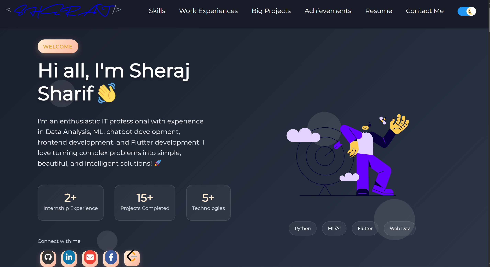

# Sheraj's Personal Portfolio ⚡️  

🚀 **Live Website:** [Visit Now](https://sherajsharif.github.io/sherajportfolio.github.io/)

<a href="https://skinai-disease-detection-frontend.onrender.com" target="_blank">  </a> 


## 🌐 A Clean, Beautiful, and Responsive Portfolio Website Built with React!

This is my personal portfolio website showcasing my skills, projects, and experience. Feel free to explore and get in touch!

---

## 📑 Table of Contents
- [Portfolio Sections](#portfolio-sections)
- [Getting Started](#getting-started)
- [How to Use](#how-to-use)
- [Linking Portfolio to GitHub](#linking-portfolio-to-github)
- [Change and Customize](#change-and-customize-every-section-according-to-your-need)
- [Deployment](#deployment)
- [Technologies Used](#technologies-used)
- [License](#license)

---

## 🧩 Portfolio Sections
✔️ Summary and About Me  
✔️ Skills  
✔️ Education  
✔️ Work Experience  
✔️ Projects Connected with GitHub  
✔️ Big Projects  
✔️ Achievements and Certifications 🏆  
✔️ Proficiency
✔️ Connects
✔️ Contact Me   
✔️ GitHub Profile  

---

## 🚀 Getting Started

These instructions will help you get a copy of the project running locally for development and testing.

### Prerequisites

Install the following:

- [Git](https://git-scm.com)
- [Node.js & npm](https://nodejs.org/en/download/)

```bash
node@v10.16.0 or higher  
npm@6.9.0 or higher  
git@2.17.1 or higher


## How To Use 

# Clone this repository
git clone https://github.com/sherajsharif/sherajportfolio.github.io.git

# Go into the repo
cd sherajportfolio.github.io

# Copy environment template
cp env.example .env

# Install dependencies
npm install

# Start development server
npm start


## Linking Portfolio to GitHub

Generate a classic GitHub personal access token following these [instructions](https://docs.github.com/en/authentication/keeping-your-account-and-data-secure/creating-a-personal-access-token#creating-a-personal-access-token-classic) (make sure you don't select any scope just generate a simple token).

1. Create a file called .env in the root directory of your project (if not done already)

2. Inside the .env file, add key `REACT_APP_GITHUB_TOKEN` and assign your GitHub token like this, also add your username as `GITHUB_USERNAME`

```env
// .env
REACT_APP_GITHUB_TOKEN = "YOUR GITHUB TOKEN HERE"
GITHUB_USERNAME = "YOUR GITHUB USERNAME"
USE_GITHUB_DATA = "true"
```

**Warning:** Treat your tokens like passwords and keep them secret. When working with the API, use tokens as environment variables instead of hardcoding them into your programs.

## Change and customize every section according to your need.

#### Personalize page content in `/src/portfolio.js` & modify it as per your need. You will also need to modify `index.html` to change the title and metadata to provide accurate SEO for your personal portfolio.

```javascript
/* Change this file to get your Personal Porfolio */

const greeting = {
  /* Your Summary And Greeting Section */
  title: "Hi all I'm [Your Name]",
  subTitle: emoji("A passionate Full Stack Software Developer 🚀"),
  resumeLink: "https://drive.google.com/file/d/YOUR_RESUME_LINK/view?usp=sharing"
};

const socialMediaLinks = {
  /* Your Social Media Link */
  github: "https://github.com/YOUR_GITHUB_USERNAME",
  linkedin: "https://www.linkedin.com/in/YOUR_LINKEDIN_USERNAME/",
  gmail: "your.email@gmail.com",
  gitlab: "https://gitlab.com/YOUR_GITLAB_USERNAME",
  facebook: "https://www.facebook.com/YOUR_FACEBOOK_USERNAME"
};
```

## Deployment

### Deploying to GitHub Pages

1. Push your code to a GitHub repository
2. Update the `homepage` field in `package.json` to point to your GitHub Pages URL
3. Run the deployment command:

```bash
npm run deploy
```

This will build your project and deploy it to the `gh-pages` branch, making it available at your GitHub Pages URL.

## Technologies Used

- React.js
- Node.js
- SCSS
- Font Awesome
- Lottie Animations
- GitHub API
- Medium API

## License

This project is licensed under the MIT License. - see the [LICENSE](LICENSE) file for details. 
=======
# sherajportfolio.github.io
>>>>>>> 15641b3b64e5ab06e9a4118a7678b0f01ec60875

📬 Contact
📧 Email: sherajsharif786@gmail.com

🧑‍💻 GitHub: github.com/sherajsharif
